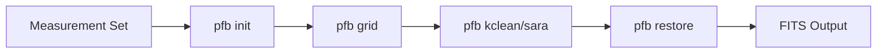

# PFB-Imaging

[](https://opensource.org/licenses/MIT)
[](https://www.python.org/downloads/)
[](https://pfb-imaging.readthedocs.io/en/latest/?badge=latest)

**PFB-Imaging** is a radio interferometric imaging suite based on the preconditioned forward-backward algorithm. It's designed for high-performance astronomical data processing with distributed computing capabilities.

## Overview

PFB-Imaging provides a comprehensive suite of tools for processing radio interferometric data, with a focus on:

- **High-performance computing**: Distributed processing using Dask
- **Advanced algorithms**: Preconditioned forward-backward optimization
- **Flexible deconvolution**: Support for classical and modern sparsity-based methods
- **Scientific accuracy**: Built on proven mathematical foundations

## Key Features

### 🚀 Performance
- **Distributed computing** with Dask for scalability
- **Memory-efficient** chunked processing for large datasets
- **Optimized algorithms** using Numba JIT compilation and DUCC0

### 🔬 Scientific Capabilities
- **Full Stokes polarization** processing
- **Advanced deconvolution** algorithms (SARA, Hogbom, Clark)
- **Sparsity regularization** with wavelet transforms
- **Preconditioned optimization** for faster convergence

### 🛠️ Developer-Friendly
- **Modular architecture** with worker-based processing pipeline
- **Configuration-driven** with YAML schemas
- **Comprehensive testing** with automated CI/CD
- **Extensive documentation** with examples and tutorials

## Quick Start

### Installation

```bash
# Install from PyPI
pip install pfb-imaging

# Or install from source
git clone https://github.com/ratt-ru/pfb-imaging.git
cd pfb-imaging
pip install -e .
```

### Basic Usage

```bash
# Initialize measurement set
pfb init --ms my_data.ms --output-filename my_output

# Create dirty image and PSF
pfb grid --output-filename my_output

# Deconvolve using classical methods
pfb kclean --output-filename my_output

# Restore clean components
pfb restore --output-filename my_output
```

## Mathematical Foundation

PFB-Imaging is built on the **preconditioned forward-backward algorithm**, which solves the optimization problem:

$$
\min_x \frac{1}{2} \|Ax - b\|^2_2 + \lambda \|Wx\|_1
$$

Where:
- $A$ is the measurement operator (gridding + FFT)
- $x$ is the image to be reconstructed
- $b$ are the observed visibilities
- $W$ is a sparsifying transform (wavelets)
- $\lambda$ controls the regularization strength

The algorithm alternates between:
1. **Forward step**: Gradient descent on the data fidelity term
2. **Backward step**: Proximal operator of the regularization term

## Architecture

The system follows a modular **worker-based pattern** where each processing step is a separate CLI command:



## Getting Help

- 📖 **Documentation**: [https://pfb-imaging.readthedocs.io/](https://pfb-imaging.readthedocs.io/)
- 🐛 **Issues**: [GitHub Issues](https://github.com/ratt-ru/pfb-imaging/issues)
- 💬 **Discussions**: [GitHub Discussions](https://github.com/ratt-ru/pfb-imaging/discussions)

## Contributing

We welcome contributions! Please see our [Contributing Guide](contributing.md) for details on how to get started.

## Citation

If you use PFB-Imaging in your research, please cite:

```bibtex
@software{pfb_imaging,
  author = {Bester, Landman},
  title = {PFB-Imaging: Radio interferometric imaging suite},
  url = {https://github.com/ratt-ru/pfb-imaging},
  version = {0.0.5},
  year = {2024}
}
```

## License

PFB-Imaging is licensed under the MIT License. See [LICENSE](https://github.com/ratt-ru/pfb-imaging/blob/main/LICENSE) for details.